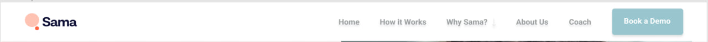
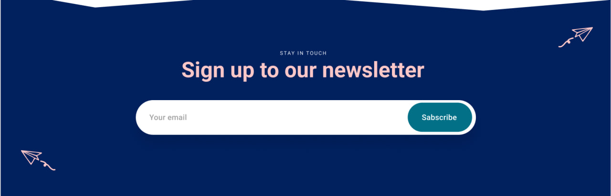

# BEM
head  
head__eye_side_left  
head__eye_side_right  
head__mouth_status_opened  

hair  
hair_color_black  
hair_length_short  
hair_style_curve  

body  
body__hand_side_right  
body__hand_side_left  
body__chest_status_strong  

legs  
legs__left_tattoo_true  
legs__right_tattoo_false  
legs__right_scar_true  

# Emmet
## Header
 
header>div.header>img.header__logo+(nav.header__nav>a*5)+button.header__btn

## Form
 
(section.sign-up>img.sign-up__plane_right+(p.sign-up__title_upper)+(h2.sign-up__title)+(form.sign-up__form>(label[for=""]>input[type="text" class="sign-up__form__input"])+(button.sign-up__form__button))+img.sign-up__plane_left)

## Card
 
(div.featured__card>img.featured__card__image+(div.featured__card__container>(h4.featured__card__theme)+(p.featured__card__content)+(p.featured__card__published_date)))

## My Choice
 
(section.elevate-engagement>(div.elevate-engagement__container>(h2.elevate-engagement__title)+(p.elevate-engagement__text)+(a.elevate-engagement__link))+img.elevate-engagement__image)